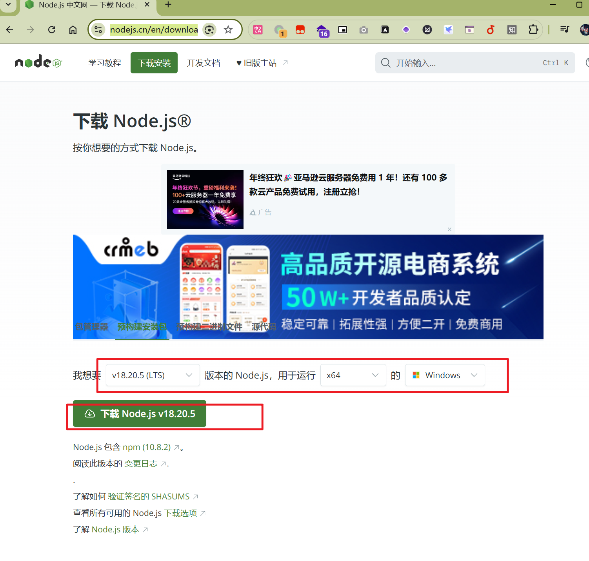
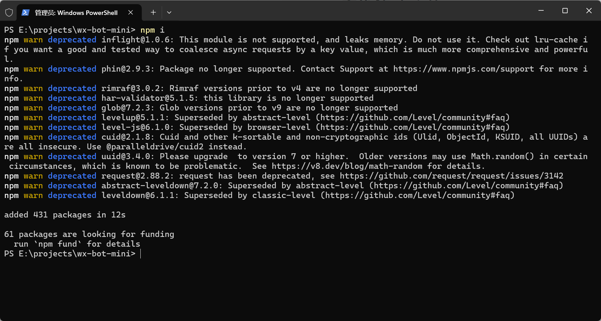
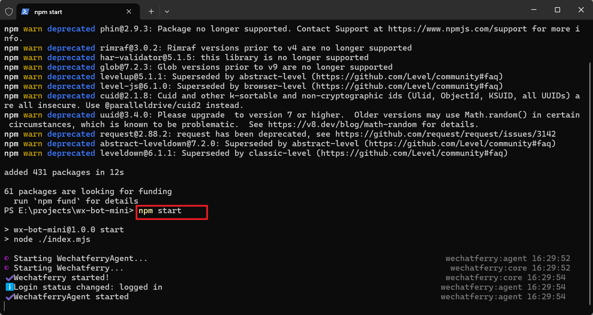
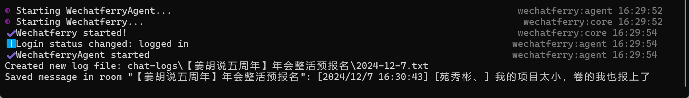
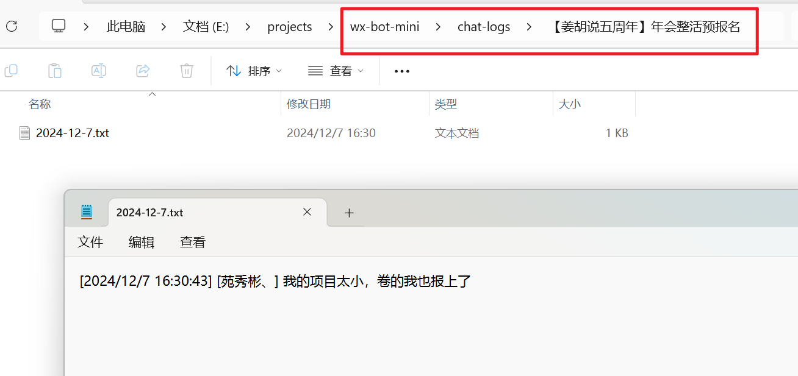

# wx-bot-mini

## 项目说明

这是一个微信机器人，基于wechaty和wechatferry开发。

会自动记录群消息，并保存到本地。

聊天文件默认保存到当前目录下的`chat-logs`文件夹中。

## 项目结构

- index.mjs 主文件，用于启动机器人
- package.json 项目配置
- README.md 项目说明

## 环境要求和配置

### Node.js 18.17.1

下载地址: <https://nodejs.cn/en/download/prebuilt-installer>



## 安装依赖

在当前目录下打开终端，输入以下命令安装项目依赖

```bash
npm i
```



## 启动项目

在当前目录下打开终端，输入以下命令启动项目

```bash
npm start
```



## 效果展示

当有人在群里发送消息时，会自动记录到本地。




